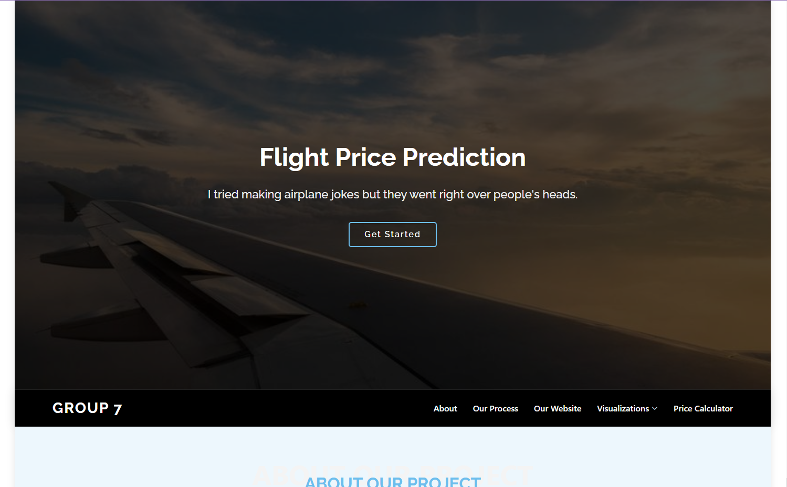

# Flight Price Prediction Calculator
## Description

Holidays are right around the corner. It’s time for people to put their travel plans on the calendars. Whether you’re trying to make that last minute flight for Thanksgiving dinner or planning months in advance for that beach vacation trip, what will prices look like? The goal of this project is to predict the flight price on a particular future date using a machine learning algorithm that will train historical data.

## Group Members
1. Aimee Vu
2. Robert Benedict (Bobby)
3. Chris Howard
4. Heesoo Oh
5. Sarje Page
6. Jarvis Lampton
7. Juvante Gant (Vante)
8. Steven Rufus
9. Juhita Vijjali

## Datasets:
* <a href="https://www.kaggle.com/datasets/shubhambathwal/flight-price-prediction">Kaggle Flight Price Prediction</a>
* <a href="https://www.transtats.bts.gov/fuel.asp">Bureau of Transportation Statistics</a>
* <a href="https://www.eia.gov/dnav/pet/hist/eer_epjk_pf4_rgc_dpgD.htm">US Energy Information Administration</a>

## Tasks:
* Database (PostGres) - Sarje, Juhita
* Python/Jupyter/Machine Learning - Bobby, Vante, Chris
* Supervised ML
* Tableau - Vante, Steven
* Flask API - Bobby
* JavaScript - Jarvis, Aimee, Heesoo
* HTML/CSS Front-end - Aimee, Heesoo
* PowerPoint/Slide Deck - Heesoo

## ETL Process: 

The ETL process of preparing and cleaning our data was a demanding task and took up the majority of the project's duration.
  1. Took the economy and business csv raw data from Kaggle, cleaned, and concatenated the datasets together, then converted the final Data Frame to a csv.
  2. Created and set up a Postgresql (relational) database that read in our data frames from Python into several different tables based off a normalized schema
  3. Created the initial testing and training data for the ML model.

## Machine Learning Algorithm:

## Website Design:
### Front-End

Wireframe

### Back-End

## Final Product: 

Site: <a href="https://aimeevu.github.io/group-7-project-4/templates/#">https://aimeevu.github.io/group-7-project-4/templates/#</a>

